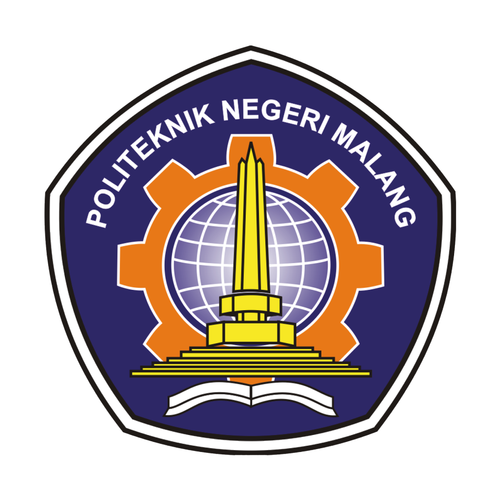
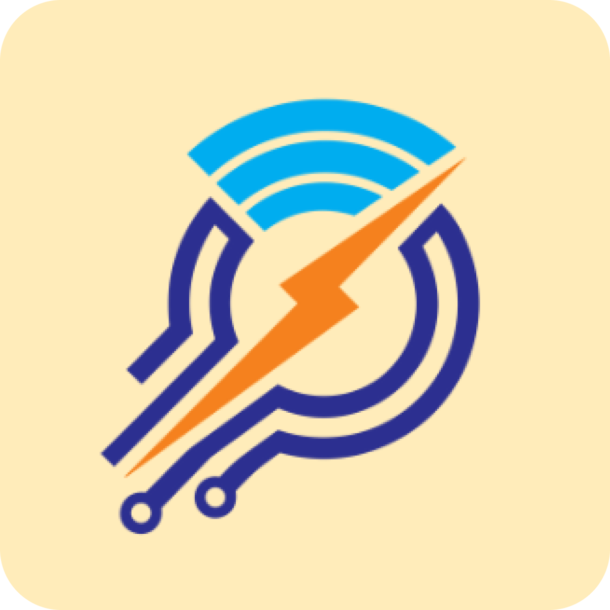

 
    
    &nbsp;&nbsp;&nbsp;
    

---

# Power Sense Project

*Developed by Electrical Engineering and Information Technology, POLINEMA*

 

### 🏛️ Contributing Departments

<table>
  <tr>
    <td align="center" width="280">
      
        
      <b>Jurusan Teknik Elektro (JTE)</b>
       
      <i>Hardware, IoT Sensing & Power Telemetry</i>
    </td>
    <td align="center" width="280">
      
        
      <b>Jurusan Teknologi Informasi (JTI)</b>
       
      <i>Software Architecture, Analytics & Dashboard</i>
    </td>
  </tr>
</table>

 

---

### 🌐 About Power Sense

**Power Sense** is a collaborative research and development initiative from the **State Polytechnic of Malang (POLINEMA)** uniting the **Department of Electrical Engineering (JTE)** and the **Department of Information Technology (JTI)**.

Our mission is to build intelligent, scalable, and data-driven solutions for sustainable energy management, bridging physical electrical infrastructure with modern cloud and IoT technologies.

---

  Power Sense POLINEMA • Empowering Smart and Sustainable Campus Energy Management

